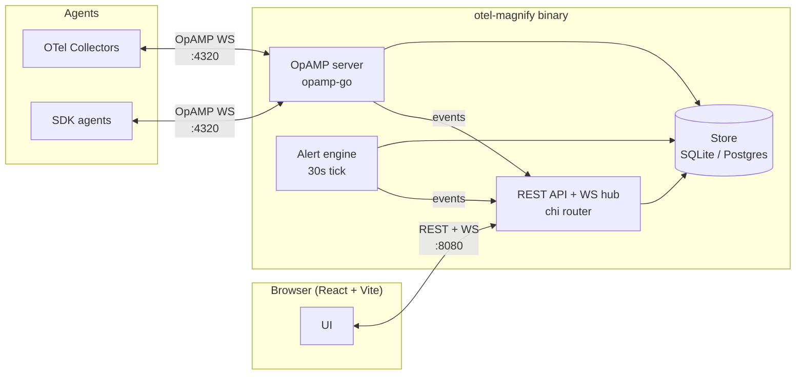

# Architecture

otel-magnify is a single Go binary that embeds a React frontend. It exposes three network endpoints: the HTTP API (with frontend), the OpAMP WebSocket server, and the browser WebSocket hub.

## Top-level layout



## Module layout

```
backend/
├── cmd/server/          # entrypoint, embeds frontend via embed.FS
├── cmd/sdkagent/        # SDK agent simulator (dev tool)
├── internal/
│   ├── api/             # chi router, REST handlers, WebSocket hub
│   ├── alerts/          # alert engine, webhook notifier
│   ├── auth/            # JWT HS256, middleware
│   ├── config/          # env-based configuration
│   ├── opamp/           # OpAMP server, agent registry, config push
│   └── store/           # SQLite/Postgres via goose migrations
└── pkg/models/          # shared structs
```

## Key design decisions

- **`pressly/goose` over `golang-migrate`** — better `modernc.org/sqlite` support (pure Go, no CGO required).
- **OpAMP server uses `Attach()`** to mount on the chi mux, not as a standalone server.
- **Agent type detection via `isCollectorName()`** — matches the `otelcol*` prefix patterns.
- **WebSocket auth via `?token=` query parameter** — browsers cannot set custom headers on WS handshakes.
- **Frontend served via `embed.FS` with SPA fallback** for the single-binary deployment model.
