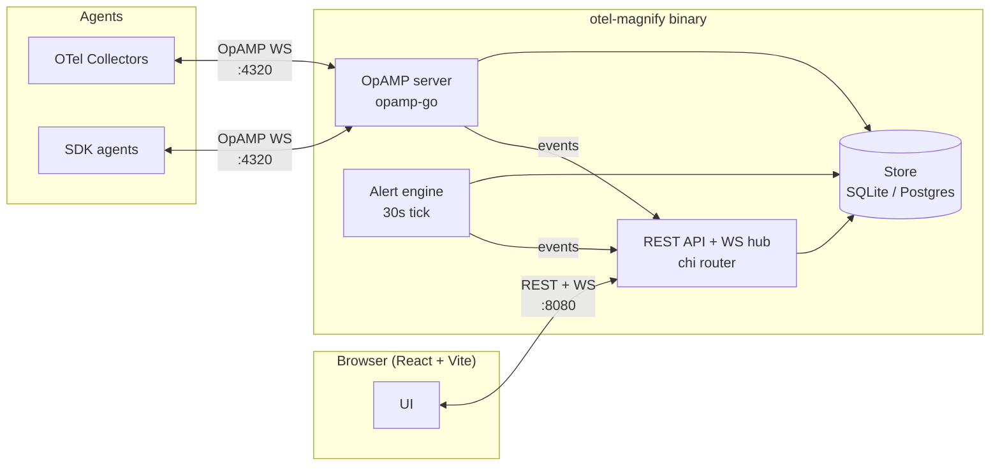

# Architecture

otel-magnify is a single Go binary that embeds a React frontend. It exposes three network endpoints: the HTTP API (with frontend), the OpAMP WebSocket server, and the browser WebSocket hub.

## Top-level layout



## Module layout

```
cmd/server/          # entrypoint, embeds frontend via embed.FS
cmd/sdkagent/        # SDK agent simulator (dev tool)
internal/
├── api/             # chi router, REST handlers, WebSocket hub
├── alerts/          # alert engine, webhook notifier
├── auth/            # JWT HS256, middleware
├── config/          # env-based configuration
├── opamp/           # OpAMP server, workload registry, config push
├── workloads/       # fingerprint + in-memory instance registry + janitor
└── store/           # SQLite/Postgres via goose migrations
pkg/models/          # shared structs
go.mod               # module root (github.com/magnify-labs/otel-magnify)
```

## Key design decisions

- **`pressly/goose` over `golang-migrate`** — better `modernc.org/sqlite` support (pure Go, no CGO required).
- **OpAMP server runs on a dedicated `http.ServeMux` on `:4320`**, separate from the chi-based API mux on `:8080`. `Attach()` returns the handler and `ConnContext` hook, which are wired into the OpAMP-only mux at `/v1/opamp`. Keeping them on different listeners avoids the OpAMP protocol leaking into the user-facing router.
- **Workload-centric data model** — persistence is keyed by workload (a K8s Deployment/DaemonSet/StatefulSet/Job/CronJob, or host+service). Individual pods are tracked as instances in an in-memory registry and are not persisted. See [OpAMP flow](opamp-flow.md) and [Connecting agents / Workload identity](../users/connecting-agents.md#workload-identity).
- **Agent type detection via `isCollectorName()`** — matches the `otelcol*` prefix patterns; determines the collector vs SDK agent category shown in the UI.
- **WebSocket auth via `?token=` query parameter** — browsers cannot set custom headers on WS handshakes.
- **Frontend served via `embed.FS` with SPA fallback** for the single-binary deployment model.
