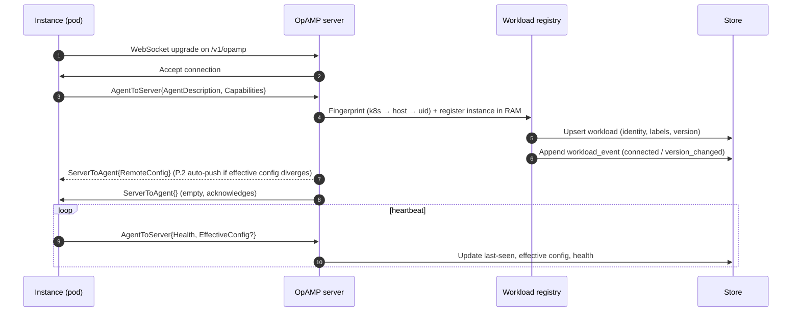
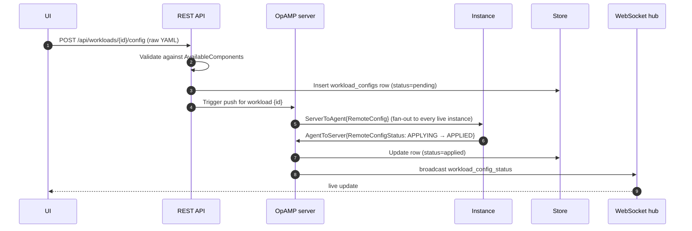
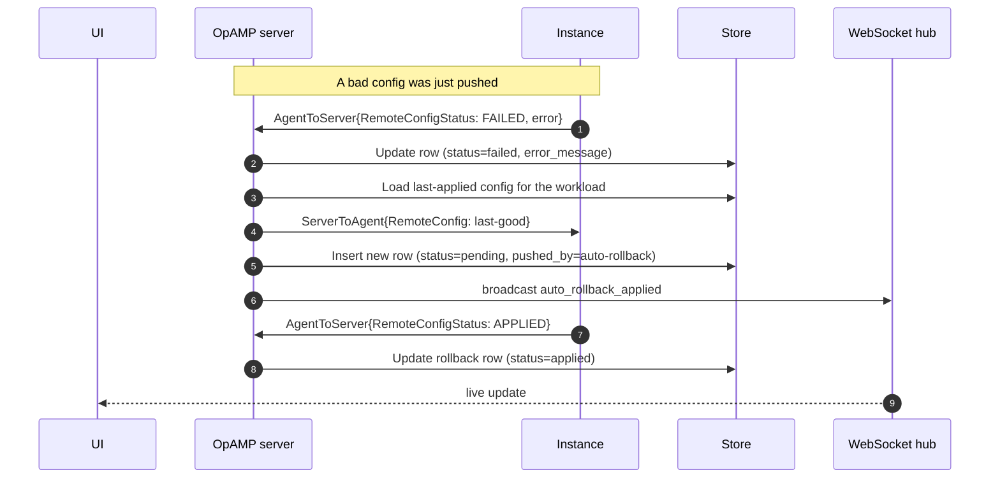

# OpAMP flow

This page walks through the full lifecycle of an agent connection and config push, from first handshake to auto-rollback on failure.

All persistence is keyed by **workload** (the logical unit) — individual pods are tracked as **instances** in the in-memory registry only. See [Connecting agents / Workload identity](../users/connecting-agents.md#workload-identity) for how the fingerprint is derived.

## Connection and description

The registry runs the three fingerprint strategies in order and picks the first one whose required attributes are present:

1. **k8s** — when `k8s.namespace.name` plus a workload-kind attribute (`k8s.deployment.name`, `k8s.daemonset.name`, `k8s.statefulset.name`, `k8s.job.name`, or `k8s.cronjob.name`) are set, combined with `k8s.cluster.name` (defaults to `unknown`).
2. **host** — `service.name` + `host.name` for bare-metal or VM deployments.
3. **uid** — fallback on the OpAMP `InstanceUid`; cardinality 1 per process.

P.2 auto-push: when a new instance of an existing workload reports an effective config hash that differs from the workload's active config, the server immediately pushes the active config without waiting for an operator action. This keeps newly-scheduled pods convergent with the stored intent.

## Config push with success

## Config push with failure and auto-rollback

## Disconnect, grace period, and retention

When an instance disconnects, the registry removes it from RAM and appends a `disconnected` workload event. If no live instances remain, the workload stays `connected` for `WORKLOAD_DISCONNECT_GRACE_SECONDS` (default 120 s) — this absorbs rolling updates and pod restarts without flapping the UI. After the grace the workload flips to `disconnected`; the janitor goroutine archives it after `WORKLOAD_RETENTION_DAYS` (default 30) and trims the `workload_events` log after `WORKLOAD_EVENT_RETENTION_DAYS` (default 30).

## Available components capture

When an instance connects, it advertises the modules compiled into it via `AvailableComponents`. otel-magnify persists this on the workload and uses it to validate config pushes before sending them — rejecting configs that reference receivers, processors, or exporters the collector cannot run.
