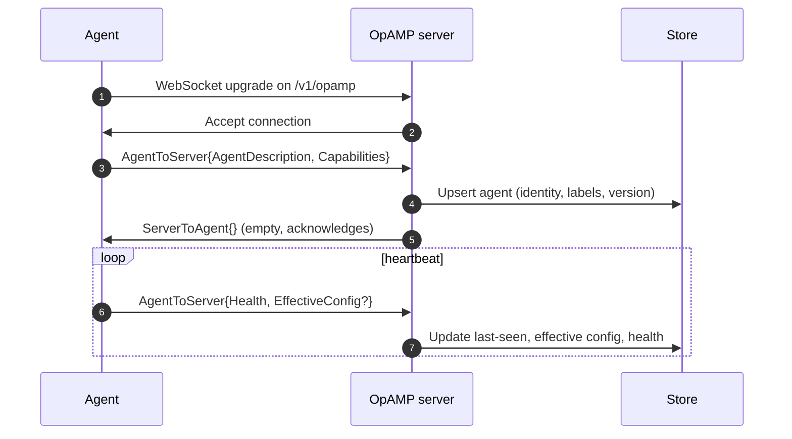
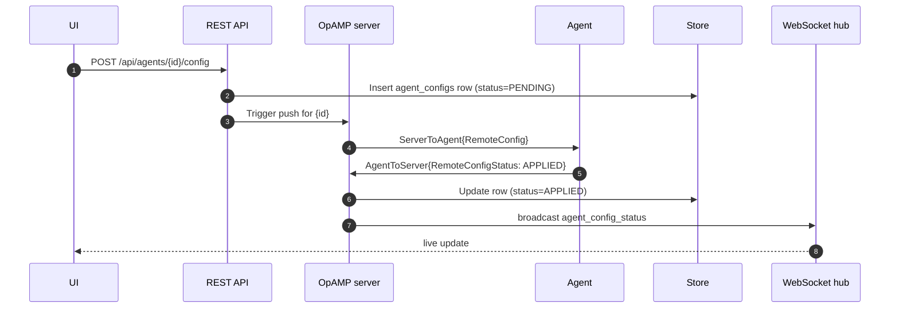
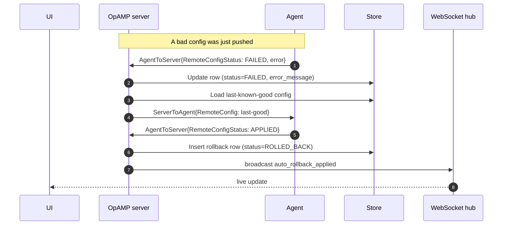

# OpAMP flow

This page walks through the full lifecycle of an agent connection and config push, from first handshake to auto-rollback on failure.

## Connection and description

## Config push with success

## Config push with failure and auto-rollback

## Available components capture

When an agent connects, it advertises the modules compiled into it via `AvailableComponents`. otel-magnify persists this and uses it to validate config pushes before sending them — rejecting configs that reference receivers, processors, or exporters the agent cannot run.
